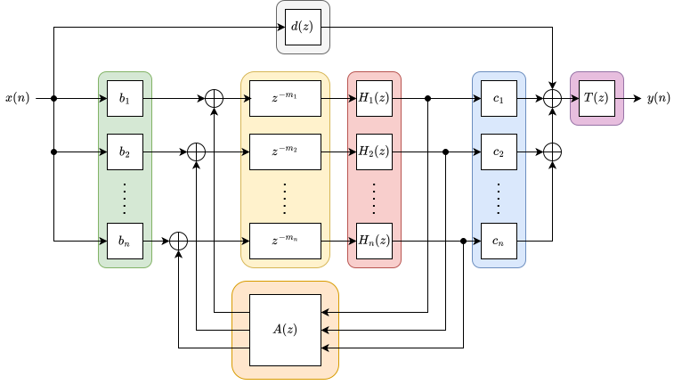

# sfFDN: Real-Time Feedback Delay Network Library

**sfFDN** is a C++ library inspired by the MATLAB Feedback Delay Network Toolbox (FDNTB) by S. J. Schlecht[1]. It provides efficient implementations of FDNs with various features such as:
- Configurable delay lines
- Different types of feedback matrices (e.g., Hadamard, Householder, Random, Circulant, etc.)
- Filter Feedback Matrices (FFM) as presented in [2]
- Single channel and multi-channel IIR filters
- Graphic Equalizers filter as presented in [3]
- Partitioned convolution for FIR filtering
- Sparse FIR filter
- Schroeder all-pass filters
- Time-varying delay lines
- Time-varying input and output gains

## Architecture
The FDN topology implemented in sfFDN is based on the canonical structure found in the literature and is shown here:


This topology can be separated into seven building blocks: the input gains (green), the delay lines (yellow), the loop filters (red), the feedback matrix (orange), the output gains (blue), the tone correction filter (purple), and the direct gain (gray). At the heart of the library is the \verb|AudioProcessor| interface. In the context of sfFDN, an audio processor is defined as a class that can take $N_{in}$ channels of audio, apply a transformation (e.g., filtering, delay, mixing matrix), and finally output $N_{out}$ channels of audio. The `AudioProcessorChain` class can be used to chain multiple audio processors in series and the `FilterBank` class can similarly be used to group multiple single-channel audio processors into a bank of parallel processor.

<details>

<summary> Input/Output gains </summary>

The input gains block supports any processor that takes a single channel of audio as input and outputs $N$ channels of audio. Conversely, the output gains block consists of any processor that takes $N$ channels of audio as input and outputs a single channel of audio. The simplest and most common implementation of these blocks is a simple gain processor that applies a scalar gain ($b_i$, $c_i$) to each channel. This functionality is provided by the `ParallelGains` class which can either split a single input channel into $N$ output channels (input gains) or sum $N$ input channels into a single output channel (output gains). FIR filters are a commonly added at the input and/or output of the FDN to simulate early reflections and increase echo density. This effect can be achieved by chaining an 'FIR' processor with the `ParallelGains` processor. For longer FIR filters, the `PartitionedConvolver` processor can be used to greatly reduce the computational cost of the convolution. Fagerström et al. (2020)[^4] proposed a novel FDN structure where the input and output gains are replaced by velvet noise filters, resulting in an increase in echo density. This so-called velvet-noise FDN can be implemented easily in sfFDN by using the `SparseFIR` class which provides an efficient implementation of sparse FIR filters, especially suited for velvet-noise sequences. The `FilterBank` processor can also be used to create a bank of parallel filters, allowing for each channel to have its own unique FIR or velvet-noise filter.

</details>

<details>

<summary> Delay Lines </summary>

For efficiency reasons, sfFDN restrict the main delay lengths to integer values, but fractional and
time-varying delay lines can easily be integrated by including a `DelayInterp` or `DelayTimeVarying`
processor inside the loop filter block. The `GetDelayLengths()` function provide a conve-
nient way to generate delay lengths based on several heuristics:

- **Random** Randomly generate delay lengths pulled from a uniform distribution
- **Gaussian**: Randomly generate delay lengths pulled from a Gaussian distribution.
- **Prime**: Randomly generate delay lengths pulled from a uniform distribution. Delays are guaranteed to be prime numbers.
- **Uniform**: Delays are uniformly spaced between a minimum and maximum value.
- **Prime Power**: Delays are integer powers of prime numbers. Based on the implementation found
in the Faust library
- **Steam Audio**: Re-implementation of the delay length generation method used in the reverberator of the Steam Audio Library. This heuristic is based on the Prime Power method but with some amount of randomization added.
- **Mean Delay**: Delays are generated based on Eq.(40) from (Schlecht & Habets, 2017a)[^5]. The resulting delays are logarithmically spaced to obtain a desired mean delay length and standard
deviation.

</details>

<details>
<summary> Feedback Matrix </summary>

The feedback matrix supports any processor that takes N channels of audio as input and outputs $N$ channels of audio. Common feedback matrices implemented in sfFDN by the ScalarFeedbackMatrix class include the Hadamard, Householder, random orthogonal, circulant, the allpass and nested allpass feedback matrix from (Schlecht, 2021)[^6], as well as the identity matrix. Arbitrary matrix can also be constructed by providing the matrix coefficient directly. The FilterFeedbackMatrix class is also provided and implements the filter feedback matrix structure proposed by Schlecht and Habets (2020)[^7]. The matrix multiplications are performed using [Eigen](https://libeigen.gitlab.io) for fast performance.

</details>

<details>
<summary> Loop Filters </summary>

The loop filters block is an optional block that supports any processor that takes $N$ channels of
audio as input and outputs $N$ channels of audio. Most commonly, a bank of $N$ parallel filters are used to control the decay time of the FDN. The function `CreateAttenuationFilterBank()` can be used to create a bank of filters to control the decay time of the FDN. The type of filter used depends on the length of the `t60s` span parameter. If 1 $T_{60}$ value is provided, a simple homogenous decay is applied to all delay lines using a simple gain scalar. If 2 $T_{60}$ values are provided, a one-pole lowwpass filter is designed to achieve the desired decay time at low and high frequencies. If 10 $T_{60}$ values are provided, a graphic equalizer filter is designed to achieve the desired decay time at 10 octave bands. The `FilterBank` class can also be used to create an arbitrary bank of parallel filters, allowing for each channel to have its own unique filter.

</details>

## Example Usage

Here is an example of how to create a 'classic' FDN of 8 delay lines with a Hadamard feedback matrix:

```cpp
#include <sffdn/sffdn.h>
constexpr uint32_t kSampleRate = 48000;
constexpr uint32_t kFDNOrder = 8;

sfFDN::FDN fdn(kFDNOrder);

// Set all input gains to 0.5
std::vector<float> input_gains(kFDNOrder, 0.5f);
fdn.SetInputGains(input_gains);

// Set all output gains to 0.5
std::vector<float> output_gains(kFDNOrder, 0.5f);
fdn.SetOutputGains(output_gains);

// Set Hadamard feedback matrix
auto feedback_matrix = std::make_unique<sfFDN::ScalarFeedbackMatrix>(kFDNOrder, sfFDN::ScalarMatrixType::Hadamard);
fdn.SetFeedbackMatrix(std::move(feedback_matrix));

// Set random delay lengths
std::vector<uint32_t> delays = sfFDN::GetDelayLengths(kFDNOrder, 500, 3000, sfFDN::DelayLengthType::Random);
fdn.SetDelays(delays);

// Set homogeneous decay of 1 second
constexpr std::array t60s = {1.0f};
auto attenuation_filter = sfFDN::CreateAttenuationFilterBank(t60s, delays, kSampleRate);
fdn.SetFilterBank(std::move(attenuation_filter));

```

## Build

The library is built using CMake. **sfFDN** uses [vcpkg](https://vcpkg.io/en/) to manage dependencies. CMake presets are provided for building with Ninja and LLVM.

```bash
# configure with Ninja and LLVM
cmake --preset llvm-ninja

# build
cmake --build --preset llvm-debug
```

## Dependencies

- [Eigen](https://eigen.tuxfamily.org/dox/) - Linear algebra library
- [PFFFT](https://bitbucket.org/jpommier/pffft/) - FFT library for partitioned convolution
- [KissFFT](https://github.com/mborgerding/kissfft) - FFT library used for FFT size less than what PFFFT supports
- [nlohmann-json](https://github.com/nlohmann/json) - Used to export/import FDN configurations to JSON files. Can be omitted if you don't need this feature by not building fdn_config.cpp
- [nanobench](https://github.com/martinus/nanobench) - Microbenchmarking library used for performance testing. Not required if SFFDN_BUILD_TESTS is OFF.
- [Catch2](https://github.com/catchorg/Catch2) - Unit testing framework used for testing. Not required if SFFDN_BUILD_TESTS is OFF.
- [libsndfile](http://www.mega-nerd.com/libsndfile/) - Used in unit tests for reading/writing WAV files. Not required if SFFDN_BUILD_TESTS is OFF.

## References
[1] S. J. Schlecht, “FDNTB: the feedback delay network toolbox,” 23rd International Conference on Digital Audio Effects (DAFx2020), 2020.

[2] S. J. Schlecht and E. A. P. Habets, “Scattering in Feedback Delay Networks,” IEEE/ACM Transactions on Audio, Speech, and Language Processing, vol. 28, June 2020.

[3] V. Välimäki, K. Prawda, and S. J. Schlecht, “Two-Stage Attenuation Filter for Artificial Reverberation,” IEEE Signal Processing Letters, vol. 31, pp. 391–395, Jan. 2024, doi: 10.1109/LSP.2024.3352510.

[^4]: J. Fagerström, B. Alary, S. J. Schlecht, and V. Välimäki, “Velvet-Noise Feedback Delay Network,” in Proc. Int. Conf. Digital Audio Effects (DAFx), 2020.

[^5]: S. J. Schlecht and E. A. P. Habets, “Feedback Delay Networks: Echo Density and Mixing Time,” IEEE/ACM Trans. Audio, Speech, Lang. Process., vol. 25, no. 2, pp. 374–383, Feb. 2017, doi: 10.1109/TASLP.2016.2635027.

[^6]: S. J. Schlecht, “Allpass Feedback Delay Networks,” IEEE Trans. Signal Process., vol. 69, pp. 1028–1038, 2021, doi: 10.1109/TSP.2021.3053507.

[^7]: S. J. Schlecht and E. A. P. Habets, “Scattering in Feedback Delay Networks,” IEEE/ACM Trans. Audio, Speech, Lang. Process., vol. 28, Jun. 2020.


